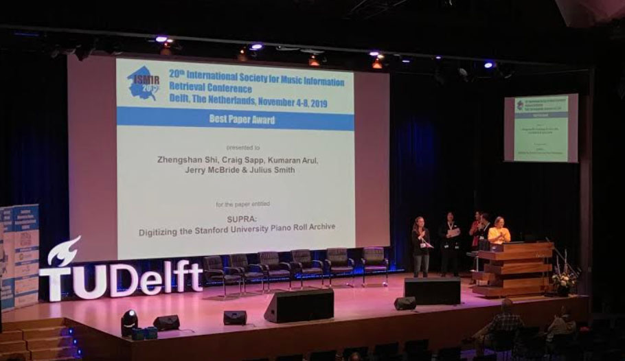

<h1> About SUPRA </h1>

This website is a research portal for piano rolls digitized from
the Stanford Libraries' collection of over 15,000 piano and organ
rolls.  As of November 2019, the website includes 456 Welte-Mignon
T-100 rolls (colloquially called "red welte" rolls since they usually
are on red paper).  The process of converting images of the piano
rolls into MIDI files has been summarized in [our
paper](http://archives.ismir.net/ismir2019/paper/000062.pdf) at the
International Society for Music Information Retrieval's (ISMIR)
2019 conference in Delft, The Netherlands, where it received the
best-paper award.  The homepage of this website contains a searchable
list of the digitized rolls with links to various resources for
each roll:

<ul>
<li> <a href="https://searchworks.stanford.edu/view/10760282">SW</a>:
Searchworks &mdash; this is the online card-catalog system of
Stanford University.  Additional searching of the rolls (particularly
rolls that have not yet been digitized) can be done from this
website.  
<a href="https://github.com/pianoroll/SUPRA/tree/master/metadata/marcxml">MARC21 records</a>
for the digitized rolls are included in the SUPRA MIDI file repository.
</li>

<li> The images of the piano rolls are accessible in various formats.
If you click on the <i style='color:#999;' class='fa fa-image'></i>
icons in the list on the frontpage, you will be able to view the
rolls using a front-end to IIIF-hosted images of the rolls in the
Stanford Digital Repository along with a playback button for listening
to the roll's music (integrated audio/visual interfaces forthcoming).
</li>

<li> <b style="color:#999;">IA</b> links go to pages giving detailed
automatic image analysis of the piano roll images, with analyses of edge
tears, problematic holes, left/right drift analysis along the
length of the rolls (used for straightening rolls when extracting
notes).  </li>

<li> There are also links for the digitized rolls in various formats:

<ul class="indent">

	<li> The <i style='color:#999;' class='fa fa-camera'></i>
	icons link directly to the raw TIFF images of rolls (usually
	about 200-800 MB in size).  This is the green channel of
	the full-color TIFF images that are used to extract musical
	information from the rolls.  </li>

	<li> The <b style="color:#999;">Mexp</b> links point directly to "expression" MIDI
	files that are used to generate the audio versions of the
	rolls.  </li>

	<li> The <b style="color:#999;">Mraw</b> links point directly to the "raw" MIDI files
	that are used to create the expression MIDI files.  The raw
	files contain all individual holes on the piano roll, whereas
	the expression MIDI files merge multiple holes into single
	notes and interpret the expression holes into note dynamics
	as well as pedaling.  </li>

	<li> The <b style="color:#999;">MP4</b> links point directly to MP4/M4A/AAC compressed
	audio files generated by software synthesis from the
	expression MIDI files.  </li>

	<li> The <b style="color:#999;">MP3</b> links are similar, but made available for
	applications that cannot read MP4 files.  </li>

</ul>

</li>
</ul>

In addition to downloading individual digitized files on this
website, there are two other ways of getting access to the files
as a group:

* The SUPRA dataset is available on Github in the [pianoroll/SUPRA](https://github.com/pianoroll/SUPRA)
repository.  This repository contains all of the raw and expression MIDI
files in their most recent versions.

* The [SUPRA-RW dataset, version
1.1](https://purl.stanford.edu/xf457dx9166) is available in the
Stanford Digital Repository.  This version of the data also includes
the WAVE files used to create the compressed audio files found
on this website.  

The audio files on this website as well as in the SUPRA-RW dataset
are exactly aligned with the accompanying MIDI files, making them
suitable for studies on score-to-audio alignment.  Also see the
[webpage](/sv) describing how to use the audio and MIDI files in 
Sonic Visualiser.




