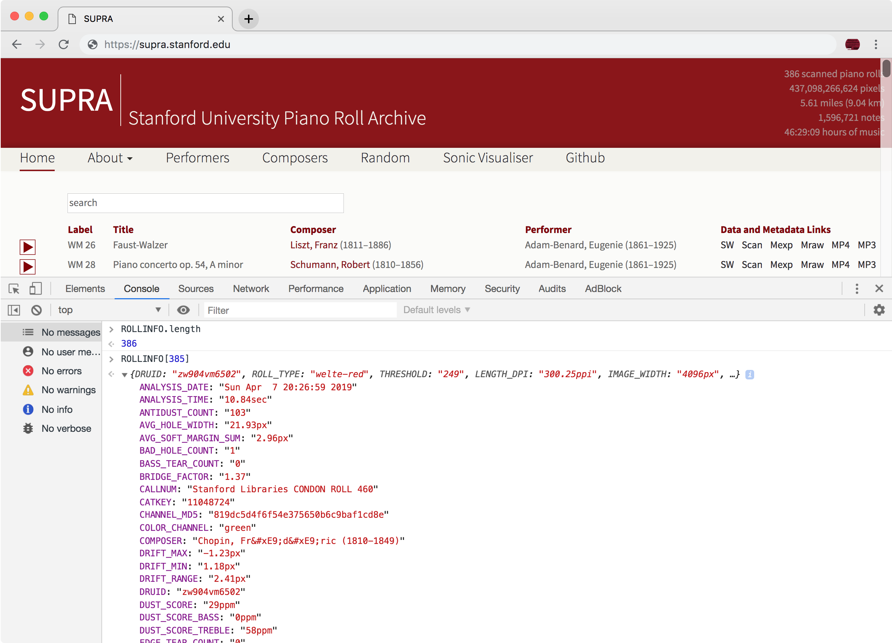

# SUPRA MIDI files #

This page describes the format for MIDI files available in the
SUPRA archive.  There are two types of MIDI files: (1) "raw" MIDI files
where each musical hole on the physical roll is represented by a
note in the MIDI data, and (2) "expressive" MIDI files, where the individual
holes have been merged into single notes (debridged), note durations have
been extended slightly due to the width of the tracker bar, and expression
controls on the left/right sides of the roll are interpreted as attack
velocities for notes (as sustain/soft pedals controls added).

MIDI files can be accessed with three methods:

<ol>
<li> <a target="_blank" href="https://github.com/pianoroll/SUPRA">SUPRA Github repository</a>: This repository allows for downloading all files, either via the <i>git</i> program, or via a link to a zip file found on the repository homepage. </li>
<li> <a target="_blank" href="/">SUPRA homepage</a>: For each entry on the list of music on the SUPRA homepage, there are links to the "raw" and "expressive" MIDI files on the right side of the listings.  Right click on the "Mraw" or "Mexp" links to save the MIDI file to your local computer. </li>
<li> <a target="_blank" href="https://purl.stanford.edu/zw904vm6502">PURL pages</a>: the expressive MIDI file is available in the download section of the Universal Viewer found on the PURL pages (bottom left corner of the image window).  </li>
</ol>

## Raw MIDI files ##

For every hole in the original roll, there is a MIDI note.  These individual holes
may be merged into a single note later according to the <b>BRIDGE_FACTOR</b> 
parameter (see metadata further below).  This MIDI file is not intended for
listing purposes, but rather for re-cutting (making copies of the original paper
rolls).

There are five tracks in the MIDI file:
<ul>
<li> Track 0: tempo indications and metadata parameters.</li>
<li> Track 1: Note holes in the bass register, using MIDI channel 2.</li>
<li> Track 2: Note holes in the treble register, using MIDI channel 3.</li>
<li> Track 3: Expression holes for the bass register, using MIDI channel 4.</li>
<li> Track 4: Expression holes for the treble register, using MIDI channel 5.</li>
</ul>

Expression holes are given a quiet note attack for proof listening.  Regular
note holes are also played softly unless initial analysis by the image processing
software identifies the hole as the start of a note, in which case the note hole
is played loudly.  Note that the expression is not interpreted/applied 
to the "raw" MIDI file.

### Timing ###

In both the "raw" and "expressive" MIDI files, the tempo of the roll is stored
in the ticks-per-quarter-note (pulses-per-quarter-note) parameter in the 
header of the MIDI file.  This value is usually 5 times the performance tempo
of the roll (such as 500 if the tempo is 100).  DEA rolls will have a different
multiplication factor other than 5.  Each MIDI tick is equivalent to one pixel
row in the original image.  Time 0 in the MIDI file is the position of the
first musical note hole in the image, which is at the image row given 
in the <b>FIRST_HOLE</b> metadata parameter.  If the first "musical" hole is
an expression hole, the final "expressive" MIDI file may have silence 
at the start of the MIDI file, since the expression holes are silenced or 
removed from the expressive MIDI files.

### Acceleration emulation ###

Raw MIDI files will usually include acceleration emulation in the
tempo track (track 0).  When a roll is performed on a mechanical
instrument, the winding mechanism pulling the roll around the take-up
spool is rotating at a constant speed. As the paper builds up the
diameter of the take-up spool, the speed at which the paper is
moving will increase.  This is estimated to be 0.22%/foot, so every
3600 ticks in the MIDI file, there will be an updated tempo value
which is 0.22% greater than the previous tempo.  The effect of tempo
acceleration is needed for rolls greater than about 100 feet, since the
end of the roll will otherwise sound like it is slowing down without
the emulation.

Note that the tempo meta messages in the MIDI file are only used for 
acceleration emulation.  The "tempo" of the roll is found in the MIDI
header, in the ticks-per-quarter-note parameter.  This allows for the
acceleration emulation and the starting tempo to be set independently.
This also allows for the tick values in the MIDI file to represent
pixel rows in the original image.

## Expressive MIDI files ##

The expressive MIDI files are generated from the "raw" MIDI file.  There
are several pre-processing steps: (1) remove the bridging from the raw holes
by merging holes that are closer than the <b>BRIDGE_FACTOR</b> parameter
in the metadata found in track 0; (2) tracker-bar holes have a height which
will increase the effective length of holes after bridging has been removed.
After these two steps have been done, the dynamics of each register are
modeled and applied to the velocities of the sounding notes.  Typically the
expression tracks (tracks 3 and 4 will be removed from the final expressive
MIDI file), so there are usually 3 MIDI tracks in the expressive MIDI files:

<ul>
<li> Track 0: tempo indications and metadata parameters.</li>
<li> Track 1: Note holes in the bass register, using MIDI channel 2.</li>
<li> Track 2: Note holes in the treble register, using MIDI channel 3.</li>
</ul>

Expression MIDI file add additional metadata parameter that describe how
the realization of the velocities was calculated (see the metadata
section below for more information).

## Metadata parameters ##

All SUPRA MIDI files contain metadata fields describing the MIDI
file, such as the title, composer, and performer, as well as detailed
parameters describing the analysis of the original roll image and
interpretation of expression applied to the roll.  The metadata is
stored as text meta messages in the tempo track of the MIDI file.
Each parameter is stored in a separate text meta message.  The basic
structure of an entry is:

```
@KEY: VALUE
```

In other words, the parameter key is prefixed by an `@` character
and is followed by a `:` character.  The KEY does not contain
spaces, but uses underscores to represent spaces in the parameter
name.  The value contains any number of characters, with accented
letters in title/composer/performer names represented by hexadecimal
unicode numeric entities, such as "&#xE9" for the letter "é" (this
encoding is taken directly from the Stanford Libraries' XML catkey
entries for the rolls).  The order of the parameters is not fixed, 
since processing of the MIDI file may rearrange the ordering.

Metadata parameters can be extracted SUPRA MIDI files using the <a
target="_blank"
href="https://github.com/pianoroll/midiroll/blob/master/tools/rolltext.cpp">rolltext</a>
program (to be described more later).

All metadata entries from all files in the SUPRA digital archive 
are available in <a target="_blank" href="https://github.com/pianoroll/SUPRA/blob/master/index.aton">this file</a> 
in the <a target="_blank" href="https://github.com/pianoroll/SUPRA">SUPRA Github repository</a>.
The file can be converted into JSON data by using the <a target="_blank" href="https://aton.sapp.org"> ATON Javascript library</a>.
Additionally, you can view this metadata in the JavaScript console of your browser by typing the variable name <b>ROLLINFO</b>:


<figure class="figure">
  
</figure>




<div style="height:300px"></div>





