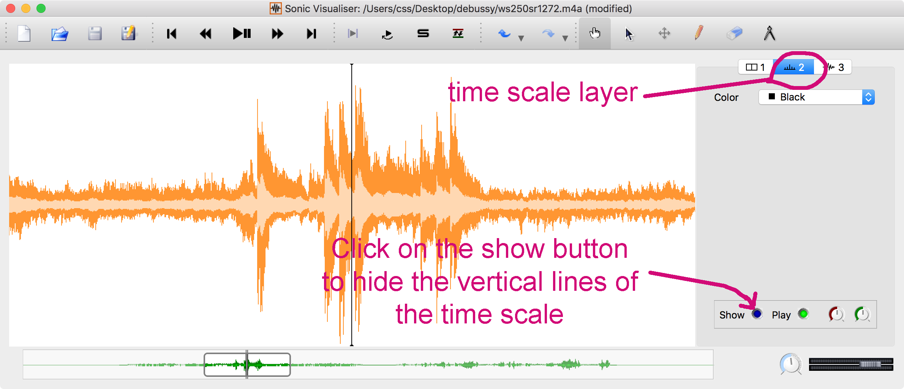

 
      

         <h3>Debussy plays Debussy</h3>
         
Rendering of Welte-Mignon 2739: Two preludes by Claude Debussy, performed by the composer.

   

<article>

<section>

<h1> Sonic Visualiser & SUPRA  </h1>

This page gives a tutorial on how to use SUPRA data files with <a target="_blank"
href="https://www.sonicvisualiser.org">Sonic Visualiser</a> (SV).
SV is an audio annotation editor that is useful for studying a
performance from SUPRA in detail.  The image at the top of the page
demonstrates some of the visualization possibilities in SV. The
waveform is colored orange.  Dark green bars are notes loaded from
a MIDI file.  The light-green bars are from a modified MIDI file
that extends notes to the end of a sustain pedal.  The sustain pedal
is shown in the background as darker regions.  The expression
(dynamics) of the treble register of the piano is given as a red
line, and that of the bass register is given in blue.

</section>

<section>
<h2> Downloading Sonic Visualiser </h2>

Download SV from <a target="_blank" href="https://www.sonicvisualiser.org/download.html">this link</a>, choosing the version for your operating system (available for Linux, MacOS, and Windows).

</section>

<section>
<h2> Sonic Visualiser Interface </h2>

Here is what the SV interface will look like when it is first opened:

<figure class="figure">
  
</figure>

The large white rectangle is the called a pane.  Controls for layers on the 
pane are given on the right side of the page.  In this case there are three
layers, with layer 1 selected.  The settings for layer 1 are visible in the
layer control panel. 

Going from left to right at the bottom of the SV window: The narrow white strip
is the audio navigator.  This region shows you were you are located along the
duration of a recording and how much of the recording is visible in the
main pane.  To the right of the navigation ribbon is the playback speed 
control.  This should usually be set to 100%, but can be adjusted to play the
audio at a faster or slower speed (it is easier to adjust the speed by 
double-clicking on the button to open up a dialog box to set the speed rather 
than trying to graphically more the speed dial).  At the far right is the
master volume slider.  This is used to control the overall loudness of the audio
file as well as any sound-based annotation effects (such as MIDI notes) 
placed in different layers (each layer will also have their own independent
volume controls).

There are also audio playback buttons and various annotation tools at
the top of the SV window which are discussed later.

<h2> Loading an audio file </h2>

SV can load both uncompressed (WAV) and compressed (MP3, MP4, etc.) audio 
files.  Download <a target="_blank" href="https://ccrma.stanford.edu/~craig/piano-roll-project/supra/welte-red/mp4-exp/ws250sr1272.m4a">this audio file</a>
and load it into SV by going to the file&rarr;Open... menu.  After loading the
SV interface should look like this:

<figure class="figure">
  
</figure>

The audio waveform is displayed in the pane.  It is in stereo, so there are
two thick blue lines showing the start of the audio.  Notice the vertical 
line in the middle of the pane, this is the current position in the audio
file (at the start in this case).  Also notice the green waveform in the
navigator ribbon at the bottom of the window.  There is a box at the left
end of the navigator that is showing where you are located in the audio
file, and how much of it is being displayed in the pane.

Next, click on the "3" tab at the top of the layer control panel.  This will 
display the controls for the waveform layer (notice the waveform icon
in tab 3):

<figure class="figure">
  
</figure>

First, try moving the box in the navigator ribbon at the bottom of the window, by
click-dragging it to the right.  After moving it around, you should see the view
of the waveform in the main pane also change.  Now try double-clicking in the
navigation ribbon: this moves you quickly to a new spot in the audio.

Most layers have the same four controls at the bottom of their control
panel that are similar to the waveform controls.  These are in order: (1) a 
toggle button to show or hide the layer in the pane, (2) a play/mute toggle
to control the sounding of the layer, (3) a layer volume control to allow
control of the loudness of the layer relative to other layers, and (4) a 
left/right pan control for the layer.

For now, try changing the other settings higher up on the waveform layer
control.  For example, change the color of the waveform from Blue to Orange.
Click on the square box with an upwards arrow.  This will auto-scale the waveform
so that the current view of the waveform will be vertical maxed (this does not
affect the volume when listening to the sounds, it only controls the visual
scaling of the waveform).  And finally, select the "Butterfly" display in the
Channels setting.  The butterfly view is a hybrid view between Separate and
Mean views: the absolute value of the left channel points up, and the absolute
value of the right channel points down.  This allows you to see any differences
in the two channels as an asymmetry in the butterfly display.  After making all
of these changes, the view show look like this:

<figure class="figure">
  
</figure>

Try pressing the up/down/left/right arrow keys.  The up/down keys are used
to zoom in/out of the waveform, and left/right are used to move forward/backward
in time on the waveform.  After testing the arrows keys, click on tab 2 to
select the time scale layer controls:

<figure class="figure">
  
</figure>

Click on the button to the right of the "Show" text at the bottom of the 
layer controls.  This will hide the vertical lines (which represent time markers).
Click again on the same button to show the horizontal scale again.

</section>

<section>
<h2> Loading a MIDI file </h2>

Save the MIDI file that generated this audio, by downloading from 
<a target="_blank" href="https://github.com/pianoroll/SUPRA/blob/master/welte-red/midi-exp/ws250sr1272_exp.mid?raw=true">this link</a>.  Then go to file&rarr;Import
annotation layer... and then select the downloaded MIDI file.  There will
be a dialog window appearing next, which you should select the default behavior
of "Merge all tracks".  After pressing OK, the view in the SV window should be:

<figure class="figure">
  
</figure>

This view is not exactly useful, since the vertical scale is linear (due to the
waveform layer being displayed on a linear scale), and musical pitch is logarithmic.  In the MIDI file layer controls, change the <b>Scale</b> option from
<i>Auto-Align</i> to <i>MIDI Notes</i>, which will give a better view of the 
musical notes:

<figure class="figure">
  
</figure>

Also download <a target="_blank" href="ws250sr1272-exp-fped.mid">this MIDI 
file</a> and load it in a similar manner to the previous one.  Change the
<i>Color</i> of the new MIDI notes to <i>Bright Green</i>.  Then click on the
tab for the other MIDI notes layer to bring it to the top of the display
in the pane.  This should result in the following view:

<figure class="figure">
  
</figure>

Try playing the audio by pressing the space bar.  You can also stop the audio
by pressing the space bar again.  Notice that the MIDI layers are sounding
at the same time as the audio file (and that the MIDI synthesizer built into
SV is basic and bad sounding).  Try muting the MIDI notes layers by toggling
the Play button at the bottom of each of their layer control panels.  
Alternatively, try leaving one of the MIDI layers audible, and try adjusting 
the volume of the layer so that it is equally perceivable with the audio
file; and also try panning the audio recording to the left and the MIDI notes
to the right, then listen with headphones to verify that the MIDI and audio
files are in sync with each other.

</section>

<section>
<h2> Loading time-instants annotation files </h2>

Download <a target="_blank" href="ws250sr1272-ped.txt">this text file</a>,
which contains a <i>time-instant</i> annotation layer for Sonic Visualiser:

<pre style="margin:auto; margin-top:20px; margin-bottom:20px; max-height: 400px; max-width:500px; scroll:auto">

</pre>

The first column contains the time of an event in seconds, and the second
item on a line is the label to show at that time.  For example, the first
entry is "8.12384	Ped" means that at time 8.12384 seconds, the sustain pedal
was pressed. The line "8.43249	*" means that at time 8.43249 seconds, the 
sustain pedal was released.  Load this annotation file into SV by going to
file&rarr;Import Annotation Layer..., then select the file.  Next, a dialog
window will appear:

<figure class="figure">
  
</figure>

 Use the settings shown in the above dialog window.  The first column
of data should be set to "Time", and the second to "Label", and the 
"Timing is specified" option should be set to "Explicitly, in seconds".  All
of these settings should be the default.  After loading into SV, the new
annotation layer should appear as vertical lines (in this case orange, but
usually SV will choose a contrasting color with the previously loaded layer):

<figure class="figure">
  
</figure>

 For variety, change the <b>Plot Type</b> for the pedal annotation layer
from <i>Instants</i> to <i>Segmentation</i>, and change the <b>Color</b> to
<i>Black</i>.  You can also click on the layers to force the display order
(in this case click on the waveform layer, then the light-green notes, then the
dark green notes layer tabs to generate the following view:

<figure class="figure">
  
</figure>

</section>

<section>
<h2> Loading time-values annotation files </h2>

Download <a target="_blank" href="ws250sr1272-bass-volume.txt">this
annotation file</a>, which contains the MIDI attack velocities for
the bass register of the roll:

<pre style="margin:auto; margin-top:20px; margin-bottom:20px; max-height: 400px; max-width:500px; scroll:auto">

</pre>

The structure of the annotation file is similar to the sustain pedal, except 
that the second column should be interpreted as a numeric value on the vertical
axis when loading into SV.  Try loading the annotation file.  There will be 
a dialog box that should have the following settings chosen:

<figure class="figure">
  
</figure>

The loaded annotation layer will be a segmented line along the time line.
The default <b>Plot Type</b> is <i>Connected Points</i>: every point marks
a data value given in the annotation file for that time position, and all 
points are linked with a straight line.  In this case the dots on the line 
represent the attack velocities of the MIDI notes for the bass register (F&sharp;4
and lower).  

<figure class="figure">
  
</figure>

Try changing the <b>Plot Type</b> to <i>Curve</i>:

<figure class="figure">
  
</figure>

The <i>Curve</i> style hides the individual data points on the line,
but makes the line more visible.  Try adding another time-value
annotation by loading <a target="_blank"
href="ws250sr1272-treble-volume.txt">this file</a>, which contains
the attack velocities of the notes in the treble register.  Set the
color of the line to <i>Red</i>, and set the <b>Plot Type</b> to
<i>Curve</i>:

<figure class="figure">
  
</figure>

Now the annotation display in SV matches that of the image at the top of 
this page.

</section>

<h3> Sections to write: </h3>

<section>
<h2> Saving SV project file </h2>
</section>

<section>
<h2> Audio annotation Plugins </h2>
<h3> Audio loudness </h3>
<h3> Onset detection </h3>
</section>

<section>
<h2> Measuring time on the pane </h2>
<h3> Pedal/note timings </h3>
<h3> Hand breaking </h3>
</section>

<section>
<h2> Creating your own annotation layers </h2>
<h3> Add labels to mark structure or other features </h3>
<h3> Tap out the beat </h3>
</section>

</article>




